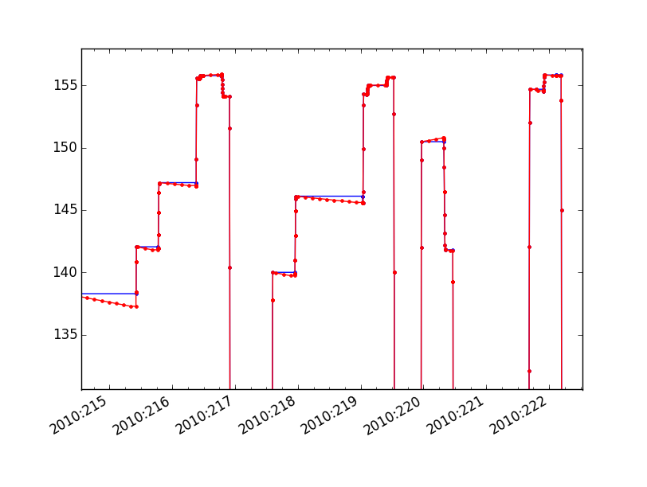

Testing of changes to use mock GET_PITCH commands
=================================================

Used the timelines code to make a new test database and cmd states for 2010.  This made
the archive by stepping through the days, which we don't care about for this, but, in the
timelines repo:

    import timelines_test
    timelines_test.all_2010(cmd_state_ska='/data/fido/ska')

I then used fetch_states against the flight cmd_states.h5 and the testing cmd_states.h5 to
create dat files limited to the columns that really should not be changing due to this
update.

    from Chandra.cmd_states.get_cmd_states import fetch_states
    from astropy.table import Table
    
    official = fetch_states(start='2010:005', stop='2010:360', vals=['obsid', 'power_cmd',
      'si_mode', 'pcad_mode', 'vid_board', 'clocking', 'fep_count', 'ccd_count', 'simpos',
      'simfa_pos', 'hetg', 'letg'], server='/proj/sot/ska/data/cmd_states/cmd_states.h5')
    Table(official).write('official_minus_point.dat', format='ascii')
    
    test = fetch_states(start='2010:005', stop='2010:360', vals=['obsid', 'power_cmd',
      'si_mode', 'pcad_mode', 'vid_board', 'clocking', 'fep_count', 'ccd_count', 'simpos',
      'simfa_pos', 'hetg', 'letg'], server='t/all_2010/cmd_states.h5')
    Table(test).write('test_minus_point.dat', format='ascii')
    
    meld official_minus_point.dat test_minus_point.dat

The small set of small timing diffs are acceptable on the non-pointing-related states.

    official = fetch_states(start='2010:005', stop='2010:360',
         server='/proj/sot/ska/data/cmd_states/cmd_states.h5')
    test = fetch_states(start='2010:005', stop='2010:360', server='t/all_2010/cmd_states.h5')

I then verified that for each state in the original list, the pitch in a matching state
starting at the same time in the new table matches within a degree or so:

    run -i check_code.py

    np.nanmax(diffs)
    1.4172683417459382

    np.nanmin(diffs)
    -1.0671455922835449

    run -i check_missing.py

The largest offsets here appear to be due to discontinuities in the "official" data at the
end of observations.  See:

